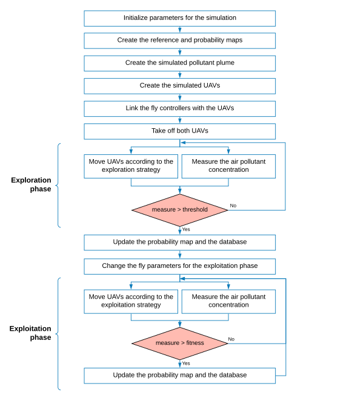
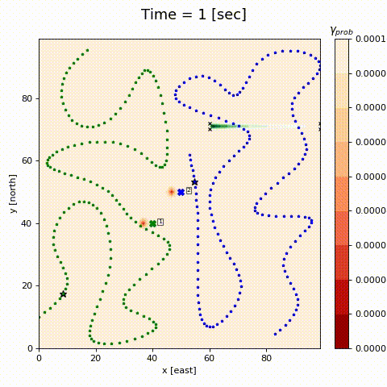

```{r setup, include=FALSE}
knitr::opts_chunk$set(echo = FALSE, cache=FALSE, message=FALSE, hide = TRUE, warning = FALSE)
library(data.table)
library(knitr)
```

## Overview
This project aims to develop the algorithms that allow the navigation of two Unmanned Aerial Vehicles (UAVs) to locate an air pollutant source in a determined search area of 500x500 m2. 
The entire project consists of a proposed Navigation Strategy and 3 others strategies that are used to compare their results.
These results will be published on the article named *Equidistributed search+Probabilitybased tracking strategy to locate an air pollutant source with two UAVs* ([IEEE Early Access Article](https://ieeexplore.ieee.org/search/searchresult.jsp?newsearch=true&queryText=Equidistributed%20search%2BProbability%20based%20tracking%20strategy%20to%20locate%20an%20air%20pollutant%20source%20with%20two%20UAVs)).
The base algorithm used with each strategy is showed in the follow figure:



## Some Results
The simulated environment has the following characteristics:

- A “matched" experiment means that 1 UAV is flying at the same height of the pollutant source
- A “no matched" experiment means that none of the UAVs is flying at the pollutant source height
- Each UAV flies at different altitude
- The search area has no obstacles for UAVs
- The UAVs autopilot works with the MAVLINK navigation protocol
- The  wind  measurements  were  obtained  from  an anemometer located at 5 meters height (off-line)
- The simulation time for each experiment is 10 minutes (due battery restrictions)
- There is only one pollutant source in the search area
- The minimum detection level is 0.01 [ppm] (given by Official Mexican Standard NOM-038-ECOL-1993, for SO2).  If  a  sensor  measure  exceeds  this  value  it  is considered as high pollutant concentration measure (named as "detection")

The next table shows a summary of the main  characteristics of each strategy  and  the  results  obtained in  the experiments.
```{r RT_table}
kable(fread("Characteristic,Strategy 1,Strategy 2,Strategy 3,Strategy 4
Exploration paths on the search area,Curved routes based on equidistributed points,Circular routes made at random points,Straight lines to random points,Steps of k meters based on Brownian motion
Exploitation paths around the detected plume,Semicircular routes around points are obtained deterministically and probabilistically,The lead UAV flies towards the location with the highest pollutant measure and the follower flies around the leader,Straight lines to points determined by the PSO algorithm,If the measurements increase the movement is continuous. If not the UAV moves on steps of k/2 meters based on Brownian motion
Median of proximity to the location of the polluting source on matched experiments,14 m,63 m,71 m,19 m
Median of proximity to the location of the polluting source on no matched experiments,16 m,72 m,90 m,76 m
Median of time until first detection on matched experiments,192 sec,113 sec,198 sec,201 sec
Median of time until first detection on no matched experiments,137 sec,141 sec,182 sec,222 sec
Median of improvement of measures on matched experiments*,20 ppm,18 ppm,6 ppm,18 ppm
Median of improvement of measures on no matched experiments*,5 ppm,6 ppm,1 ppm,5 ppm
Median of highest measures on matched experiments,21 ppm,19 ppm,7 ppm,20 ppm
Median of highest measures on no matched experiments,6 ppm,6 ppm,2 ppm,6 ppm"), align='lcccc', caption="Table 1: The planning and control components")
```
\* improvement of measures = fist detection value - highest detection value


On first instance a logic supposition is that the distance to the source and the pollutant levels have a negative correlation on all experiments.
This supposition is true when the height of the pollutant source matches with the flying height of a UAV, since its correlation index is -0.8.
On the other hand, when no UAV flies at the same height of the pollutant source the variables are not correlated.
The correlation index on this experiments is -0.15.


## Flights 

### Proposed strategy (strategy 1)

In this experiment, the source of contamination is at the same height as UAV1 (the green one) and UAV2 is one meter higher (6 meters above the ground). The green feather silhouette is the image of the z = 5 plane and represents the data that the UAV1 can measure. The blue feather silhouette is in the z = 6 plane and represents the data that the UAV2 can measure. The red area is the probability map.

Once a high measurement of pollutant is detected, the UAV fly on semicircular trajectories around the plume. With every high pollutant measurement the circle radius is reduced.



### Strategy 4
The third comparison strategy (or strategy 4) consists of a Brownian-like movement, developed by S. Zhang et. al. in [Simulation implementation of air pollution traceability algorithm based on unmanned aerial vehicle](https://iopscience.iop.org/article/10.1088/1755-1315/675/1/012012/pdf). 
In this work, both phases have similar behavior. 
The difference for the exploitation phase is a rule that prevents the UAV to select a new fly direction if its current pollutant measure is higher than the previous one.
Some modifications were required to adapt the original algorithm to our simulated platform:

1. In the exploration phase the x domain of the search map is divided for each UAV
2. The step of the UAVs is divided in half for the exploitation phase
3. The range of motion for both UAVs is restricted to be one step of the location of the best measurement taken


*AF projects: Providing high-quality and very reliable solutions for your science/engineering problems.*